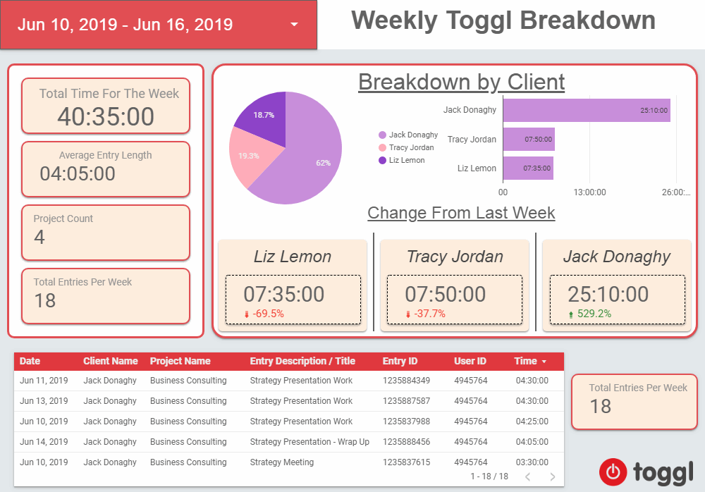

# gds-toggl-connector
# Work in progress, probably about 80% done.
## Unofficial Google Data Studio connector for Toggl Timer

## Project page
[https://joshuatz.com/projects/marketing/google-data-studio-toggl-time-tracker-connector](https://joshuatz.com/projects/marketing/google-data-studio-toggl-time-tracker-connector)

## What is this?
This is a custom Google Data Studio connector to pull in time entries and summary information from [Toggl](https://toggl.com/), the online time tracking software.

## Installation process for users
@TODO provide live production version link

Users must provide just a few details when setting up the connector for the first time:
 - Authentication:
     - User's API token is required. It can be obtained at the bottom of [https://toggl.com/app/profile](https://toggl.com/app/profile).
 - General configuration
     - Workspace: This is a space that a user belongs to in Toggl, that is used to separate accounts into logical "workspaces".
         - As long as the authentication step succeeded, you should be able to pick which workspace you want to pull data from by selecting it from the dropdown in the connector config section
     - Pre-filter billable: All data return by the connector will only be for billable entries, as opposed to both billable and non-billable. The benefit to the user would be that if they only care about billable time, they want have to keep adding filters to all their reports/widgets to keep non-billable time out.

## Build Process
You might have noticed that I wrote this using TypeScript. At the moment, I'm not using Clasp or TS2GAS to do the conversion from TS to GAS (Google Apps Script) - I'm just using a highly customized setup of tsconfig and a "pre-transpilation" build step that prepares my code for the TS compiler.

Currently, the flow is TS -> Formatter (prep-ts.js) (removes import and export statements) -> Formatter (prep-ts.js) (Concatenation of multiple TS files into single TS intermediate file) -> TSC (TypeScript Compiler) (with single TS intermediate file as input) -> Polyfill adder (add-polyfill.js) (Inlines any polyfill files, such as es6-promises, into top of TSC single output JS file).

Clasp has been setup in the final /build folder, so it will push the final transpiled JS. "npm run build-push" will execute this entire workflow.

## Tests
Tests are ran locally using Jest, in combination with ts-jest, using `npm run test`. I'm currently working on mocking some GAS environment stuff so that more methods can be tested locally.

## TODO List
 - High Priority
     - Resolve possible timezone issues
     - Get connector officially published / distributed ?
         - [Options](https://developers.google.com/datastudio/connector/publish-connector)
             - [Partner Connector](https://developers.google.com/datastudio/connector/pscc-requirements)
             - [(Open Source) Community Connector](https://developers.google.com/datastudio/connector/oscc-requirements)
 - Everything else
     - Better way of invalidating cache (global cache keys?)
     - Try to refactor getData() into more split out functions
     - Currency converters?

## Atrribution
 - Logo
     - "Iconoteka - Timeline Icon", By Oleg Turbaba, [link](https://www.iconfinder.com/icons/3507754/iconoteka_time_timeline_icon)
        - Creative Commons, Attribution, 3.0
        - [full license](https://creativecommons.org/licenses/by/3.0/legalcode)